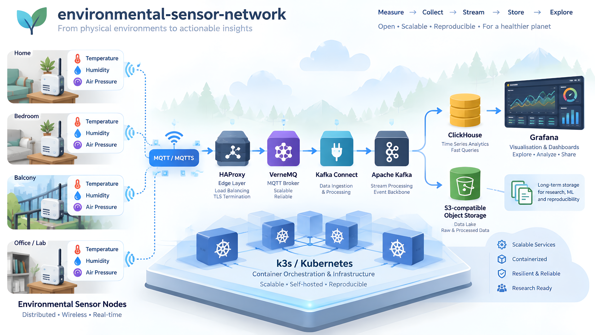
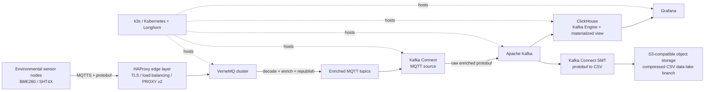

# 🌱 environmental-sensor-network

[https://github.com/pvamos/environmental-sensor-network](https://github.com/pvamos/environmental-sensor-network)

Project overview, architecture and research-output index for a **scalable environmental sensor network** developed for environmental monitoring and microclimate measurements.

The project combines low-cost distributed sensor nodes with a reproducible cloud-side ingestion, messaging, storage and visualisation stack. This repository is the **umbrella repository**: it describes how the components fit together and points to their independently maintained source repositories and archival research outputs. It intentionally does **not** duplicate the source code of those component repositories.



---

## 👨‍🔬 Research context

**Author:** Péter Vámos  
**ORCID:** [0009-0004-8554-5014](https://orcid.org/0009-0004-8554-5014)

The system was developed as the practical implementation of the 2026 BSc thesis:

**Hungarian title:**  
*Környezeti paraméterek mérése a tudomány és technológia fejlődésének tükrében – Egy skálázható szenzorhálózat megvalósításának tanulságai*

**English title:**  
*Measurement of environmental parameters in the context of scientific and technological advances – Lessons learned from implementing a scalable sensor network*

**Degree:** Expert in Applied Environmental Studies BSc  
**Institution:** John Wesley Theological College, Budapest  
**Thesis DOI:** [10.5281/zenodo.22843091](https://doi.org/10.5281/zenodo.22843091)

A related public presentation is archived separately:

**Presentation:** *Galileitől a MEMS szenzorig – A környezeti paraméterek mérésének fejlődése*  
**Event:** Planetology Esték  
**Date:** 2026-02-23  
**DOI:** [10.5281/zenodo.22869061](https://doi.org/10.5281/zenodo.22869061)

---

## 🌡 What the system does

The network measures environmental and operational parameters at distributed endpoints and forwards them into an end-to-end data platform.

The thesis implementation focuses primarily on:

- air temperature;
- relative humidity;
- air pressure;
- sensor comparison and data quality;
- local/microclimatic variation;
- low-cost distributed sensing;
- scalable data ingestion and storage;
- reproducible infrastructure and software components.

The measurement endpoints use BME280 and SHT4X-family sensors and publish compact Protocol Buffers messages over MQTT. The cloud-side platform enriches incoming messages, forwards them through Kafka, stores/queryable records in ClickHouse, exports an archival data-lake branch to S3-compatible object storage, and visualises measurements with Grafana.

---

## 📋 System architecture



### Scope

The architecture describes the main arrangement and function of the environmental sensor network at the level needed to understand the relationship between the six public component repositories.

### Architecture layers

#### 1. Measurement and sensing

Repository: [`esp32-envsensor-mqtt`](https://github.com/pvamos/esp32-envsensor-mqtt)

The endpoints read environmental sensors, build a compact Protocol Buffers `Reading` message and publish it by MQTTS. The thesis implementation uses ESP32-C3 nodes with BME280 and SHT4X-family sensors, but the research architecture is not defined by one microcontroller model. Other endpoint implementations can be added later if they emit a compatible measurement stream.

#### 2. External MQTT edge

The deployed system uses HAProxy nodes outside Kubernetes as the public MQTT edge. Their responsibilities include TLS handling, load distribution and forwarding the real client address through PROXY protocol v2.

The public six-repository set does not currently include the external HAProxy configuration as a separate repository.

#### 3. MQTT broker and semantic enrichment

Repository: [`vernemq-enrich-msg`](https://github.com/pvamos/vernemq-enrich-msg)

VerneMQ accepts authenticated sensor messages. The custom Erlang plugin:

1. filters accepted input topics;
2. decodes the endpoint `Reading` protobuf;
3. flattens sensor substructures;
4. adds broker-side metadata such as receive time, source topic, client identity and source address where configured;
5. emits an enriched protobuf message into a separate MQTT topic tree.

#### 4. Kafka ingestion and decoupling

Repository: [`kafka-cluster`](https://github.com/pvamos/kafka-cluster)

Kafka Connect subscribes to the enriched MQTT topics and writes the raw enriched protobuf bytes into Kafka. Kafka acts as the durable event-stream boundary between acquisition and downstream processing.

#### 5. Online analytical path

Repository: [`kafka-cluster`](https://github.com/pvamos/kafka-cluster)

ClickHouse consumes the Kafka topic through a Kafka Engine table and materialized view into analytical tables. Grafana queries ClickHouse for dashboards and time-series visualisation.

#### 6. Parallel archival/data-lake path

Repositories:

- [`envsensor-kafka-smt`](https://github.com/pvamos/envsensor-kafka-smt)
- [`kafka-connect-image`](https://github.com/pvamos/kafka-connect-image)

The custom Java SMT decodes the enriched protobuf record and emits a stable RFC 4180 CSV row representation. The S3 sink writes compressed CSV objects to S3-compatible storage.

#### 7. Kubernetes infrastructure

Repositories:

- [`alpine-k3s`](https://github.com/pvamos/alpine-k3s)
- [`kafka-cluster`](https://github.com/pvamos/kafka-cluster)

`alpine-k3s` prepares the Alpine Linux hosts and creates the k3s/Longhorn infrastructure. `kafka-cluster` deploys the application/data platform on top of Kubernetes using Helm and related operators/resources.

### End-to-end data flow

```text
sensor measurement
  -> endpoint protobuf
  -> MQTTS
  -> HAProxy edge
  -> VerneMQ
  -> enriched protobuf MQTT message
  -> Kafka Connect MQTT source
  -> Kafka topic
      -> ClickHouse -> Grafana
      -> custom SMT -> S3-compatible data lake
```

### Architectural boundaries

The project deliberately separates:

- measurement firmware from cloud infrastructure;
- broker-side enrichment from analytical transformation;
- streaming/online analytical storage from archival object storage;
- public reproducible source from private deployment-specific values.

This separation is also why the implementation remains split across several independently versioned repositories.

---

## 🧬 Component repositories

| Layer | Repository | Main role | Release | Version DOI | All-versions DOI |
|---|---|---|---|---|---|
| Sensing | [`esp32-envsensor-mqtt`](https://github.com/pvamos/esp32-envsensor-mqtt) | ESP32-C3 measurement firmware, sensor reading, protobuf encoding and MQTTS publication | `v1.0.0` | [`10.5281/zenodo.22884125`](https://doi.org/10.5281/zenodo.22884125) | [`10.5281/zenodo.22884124`](https://doi.org/10.5281/zenodo.22884124) |
| Infrastructure | [`alpine-k3s`](https://github.com/pvamos/alpine-k3s) | Alpine Linux + Ansible automation for the k3s/Longhorn cluster | `v1.0.0` | [`10.5281/zenodo.22884215`](https://doi.org/10.5281/zenodo.22884215) | [`10.5281/zenodo.22884214`](https://doi.org/10.5281/zenodo.22884214) |
| Platform | [`kafka-cluster`](https://github.com/pvamos/kafka-cluster) | Helm-based deployment of VerneMQ, Kafka, Kafka Connect, ClickHouse and Grafana | `v1.0.0` | [`10.5281/zenodo.22884473`](https://doi.org/10.5281/zenodo.22884473) | [`10.5281/zenodo.22884472`](https://doi.org/10.5281/zenodo.22884472) |
| MQTT processing | [`vernemq-enrich-msg`](https://github.com/pvamos/vernemq-enrich-msg) | Erlang broker plugin for protobuf decoding, metadata enrichment and republishing | `v1.0.0` | [`10.5281/zenodo.22883989`](https://doi.org/10.5281/zenodo.22883989) | [`10.5281/zenodo.22883988`](https://doi.org/10.5281/zenodo.22883988) |
| Data transformation | [`envsensor-kafka-smt`](https://github.com/pvamos/envsensor-kafka-smt) | Kafka Connect SMT converting enriched protobuf records to RFC 4180 CSV row bytes | `v1.0.0` | [`10.5281/zenodo.22883426`](https://doi.org/10.5281/zenodo.22883426) | [`10.5281/zenodo.22883425`](https://doi.org/10.5281/zenodo.22883425) |
| Connect runtime | [`kafka-connect-image`](https://github.com/pvamos/kafka-connect-image) | Reproducible Kafka Connect runtime containing MQTT/S3 connectors and the project SMT | `v1.0.0` | [`10.5281/zenodo.22884350`](https://doi.org/10.5281/zenodo.22884350) | [`10.5281/zenodo.22884349`](https://doi.org/10.5281/zenodo.22884349) |

The component repositories remain separate because they represent distinct software artifacts with different responsibilities, dependencies and release cycles.

---

## 🧮 Research outputs

### Umbrella repository archival status

This repository is currently an architecture, documentation and research-output index rather than an independently versioned software package. It therefore does **not** currently have its own Zenodo DOI and does not include a `.zenodo.json` file.

This can be reconsidered later if the repository evolves into a substantial executable research compendium with orchestration, reproducibility tooling or other independently citable research artifacts.

### Current DOI-backed outputs

| Output | Type | Identifier | Status |
|---|---|---|---|
| BSc thesis | Thesis | `10.5281/zenodo.22843091` | published |
| Planetology Esték presentation | Presentation | `10.5281/zenodo.22869061` | published |
| Component software releases | Software | six version-specific Zenodo DOIs | published |
| Extended environmental sensor dataset | Dataset | Zenodo DOI | planned |
| Extended statistical / data-science analysis | Paper / preprint | to be determined | planned |

#### BSc thesis

- **Title:** *Környezeti paraméterek mérése a tudomány és technológia fejlődésének tükrében – Egy skálázható szenzorhálózat megvalósításának tanulságai*
- **DOI:** `10.5281/zenodo.22843091`
- **Role:** root scholarly object for the 2026 BSc project

#### Public presentation

- **Title:** *Galileitől a MEMS szenzorig – A környezeti paraméterek mérésének fejlődése*
- **DOI:** `10.5281/zenodo.22869061`
- **Relationship:** supplement to the thesis

### Published software releases

All six independently maintained software components have been archived as versioned `v1.0.0` research-software releases in Zenodo.

| Repository | Version DOI | All-versions DOI | Published |
|---|---|---|---|
| `envsensor-kafka-smt` | [`10.5281/zenodo.22883426`](https://doi.org/10.5281/zenodo.22883426) | [`10.5281/zenodo.22883425`](https://doi.org/10.5281/zenodo.22883425) | 2026-09-21 |
| `vernemq-enrich-msg` | [`10.5281/zenodo.22883989`](https://doi.org/10.5281/zenodo.22883989) | [`10.5281/zenodo.22883988`](https://doi.org/10.5281/zenodo.22883988) | 2026-09-22 |
| `esp32-envsensor-mqtt` | [`10.5281/zenodo.22884125`](https://doi.org/10.5281/zenodo.22884125) | [`10.5281/zenodo.22884124`](https://doi.org/10.5281/zenodo.22884124) | 2026-09-22 |
| `alpine-k3s` | [`10.5281/zenodo.22884215`](https://doi.org/10.5281/zenodo.22884215) | [`10.5281/zenodo.22884214`](https://doi.org/10.5281/zenodo.22884214) | 2026-09-22 |
| `kafka-connect-image` | [`10.5281/zenodo.22884350`](https://doi.org/10.5281/zenodo.22884350) | [`10.5281/zenodo.22884349`](https://doi.org/10.5281/zenodo.22884349) | 2026-09-22 |
| `kafka-cluster` | [`10.5281/zenodo.22884473`](https://doi.org/10.5281/zenodo.22884473) | [`10.5281/zenodo.22884472`](https://doi.org/10.5281/zenodo.22884472) | 2026-09-22 |

Each software record includes the author ORCID, software version, source-repository link, descriptive keywords, and a reciprocal `isSupplementTo -> 10.5281/zenodo.22843091` relationship to the thesis. The component repositories record both the immutable version DOI and the all-versions DOI.

### Planned dataset

The extended dataset will be a separate Zenodo Dataset record because continued collection after the thesis produced a larger dataset than the subset analysed in the submitted thesis.

The public dataset should be pseudonymised and accompanied by a data dictionary and reproducible transformation/anonymisation script.

### Planned analysis paper

The first new research paper should analyse the extended dataset rather than republish the thesis. Suitable directions include sensor agreement, calibration, anomaly detection, microclimate event identification, clustering and prediction.

### DOI relationship graph

```text
BSc thesis DOI 10.5281/zenodo.22843091
  ├── is supplemented by -> presentation DOI 10.5281/zenodo.22869061
  ├── is supplemented by -> esp32-envsensor-mqtt v1.0.0 DOI 10.5281/zenodo.22884125
  ├── is supplemented by -> alpine-k3s v1.0.0 DOI 10.5281/zenodo.22884215
  ├── is supplemented by -> kafka-cluster v1.0.0 DOI 10.5281/zenodo.22884473
  ├── is supplemented by -> vernemq-enrich-msg v1.0.0 DOI 10.5281/zenodo.22883989
  ├── is supplemented by -> envsensor-kafka-smt v1.0.0 DOI 10.5281/zenodo.22883426
  ├── is supplemented by -> kafka-connect-image v1.0.0 DOI 10.5281/zenodo.22884350
  └── related to -> extended dataset DOI [future]
```

The reciprocal software relation is:

```text
software DOI -> is supplement to -> 10.5281/zenodo.22843091
```

### Metadata update rule

Do not create a new thesis version merely to add relationships to newly published software, datasets or papers. Update the published thesis metadata unless the thesis file itself genuinely changes and a new archival version is warranted.

See [REFERENCES.md](REFERENCES.md) for the project-level bibliography and DOI index.

---

## 📈 Dataset scope and publication plan

### Distinguish the dataset from the thesis analysis

The thesis reports a measurement campaign with **13 endpoints** and **more than 2.7 million records**. Data collection continued after the thesis analysis period, so the later extended dataset is a larger research object and must not be described as identical to the dataset analysed in the submitted thesis.

The complete later export should therefore be described as an **extended environmental sensor network dataset**, not as exactly the dataset analysed in the thesis.

### Recommended public fields

Retain scientifically useful values such as:

- timestamp;
- stable pseudonymous sensor identifier;
- BME280 temperature;
- BME280 pressure;
- BME280 relative humidity;
- SHT4X temperature;
- SHT4X relative humidity;
- optionally RSSI;
- optionally ESP32 internal temperature;
- deployment/location class at a privacy-safe granularity.

### Fields to remove or transform

Do not publish unnecessary infrastructure identifiers such as:

- public/private IP addresses;
- MQTT usernames;
- MQTT client IDs where they identify real devices;
- broker/pod/cluster names tied to the private deployment;
- MAC addresses;
- exact household/location identifiers where they create privacy risk;
- credentials, tokens or access URLs containing secrets.

### Accompanying dataset files

The dataset record should include:

- `README.md` describing scope and provenance;
- a field/data dictionary;
- licence information;
- checksums;
- a deterministic anonymisation/normalisation script;
- a statement describing the thesis-period subset;
- version/date information for the software pipeline that generated the records.

The published dataset should also document the exact time range, filtering/anonymisation steps, provenance, checksums and the relationship to the thesis-period subset.

---

## 🤟 Citation

The canonical citation for the BSc research remains the thesis DOI:

> Vámos, Péter (2026). *Környezeti paraméterek mérése a tudomány és technológia fejlődésének tükrében – Egy skálázható szenzorhálózat megvalósításának tanulságai*. DOI: 10.5281/zenodo.22843091.

When citing or reusing a specific software component, cite its **version-specific Zenodo DOI** listed above and in [REFERENCES.md](REFERENCES.md).

See [CITATION.md](CITATION.md) for the citation policy, [CITATION.cff](CITATION.cff) for machine-readable citation metadata, and [REFERENCES.md](REFERENCES.md) for the project-level research-output bibliography.

---

## ⚖ License

The MIT License is in `LICENSE`.

---

MIT License

Copyright (c) 2026 Péter Vámos pvamos@gmail.com https://github.com/pvamos

Permission is hereby granted, free of charge, to any person obtaining a copy
of this software and associated documentation files (the "Software"), to deal
in the Software without restriction, including without limitation the rights
to use, copy, modify, merge, publish, distribute, sublicense, and/or sell
copies of the Software, and to permit persons to whom the Software is
furnished to do so, subject to the following conditions:

The above copyright notice and this permission notice shall be included in all
copies or substantial portions of the Software.

THE SOFTWARE IS PROVIDED "AS IS", WITHOUT WARRANTY OF ANY KIND, EXPRESS OR
IMPLIED, INCLUDING BUT NOT LIMITED TO THE WARRANTIES OF MERCHANTABILITY,
FITNESS FOR A PARTICULAR PURPOSE AND NONINFRINGEMENT. IN NO EVENT SHALL THE
AUTHORS OR COPYRIGHT HOLDERS BE LIABLE FOR ANY CLAIM, DAMAGES OR OTHER
LIABILITY, WHETHER IN AN ACTION OF CONTRACT, TORT OR OTHERWISE, ARISING FROM,
OUT OF OR IN CONNECTION WITH THE SOFTWARE OR THE USE OR OTHER DEALINGS IN THE
SOFTWARE.
